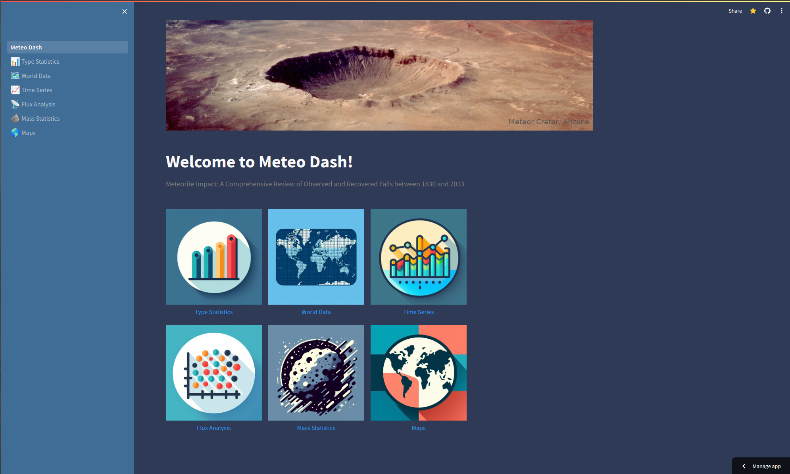
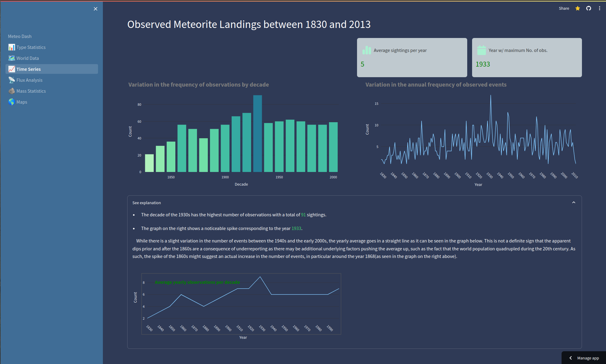
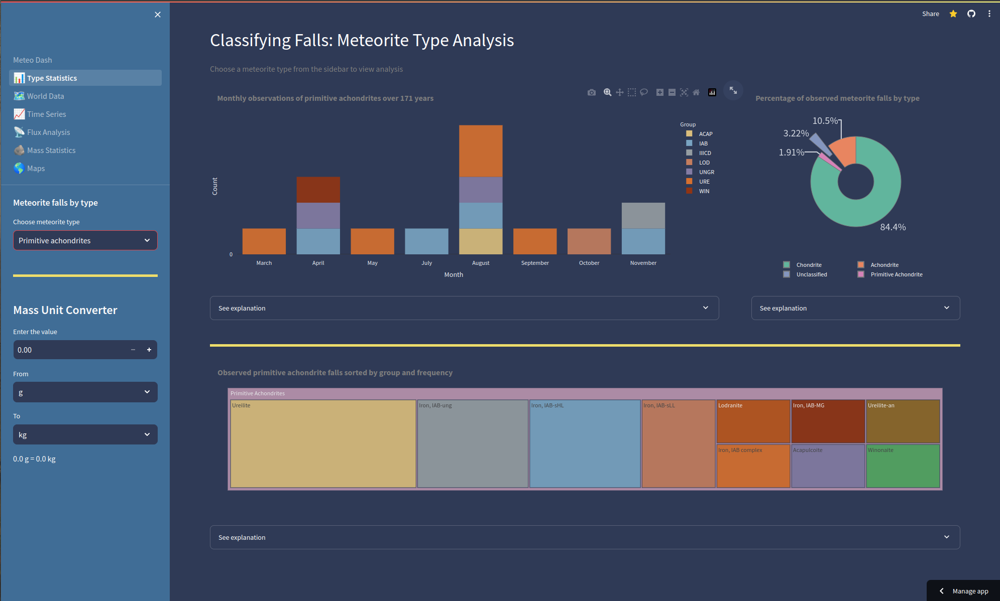
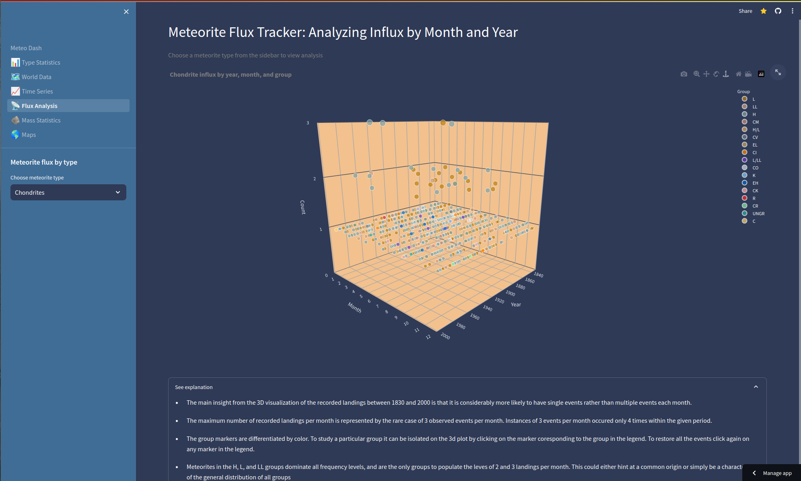
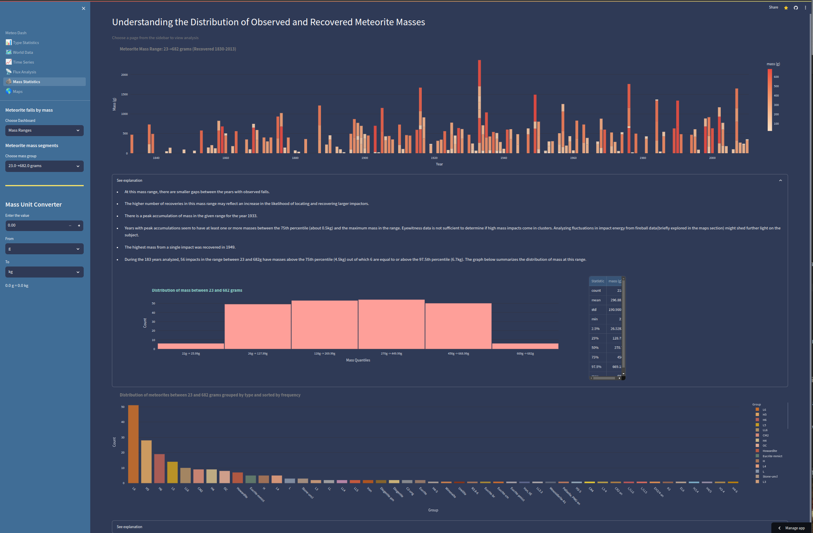
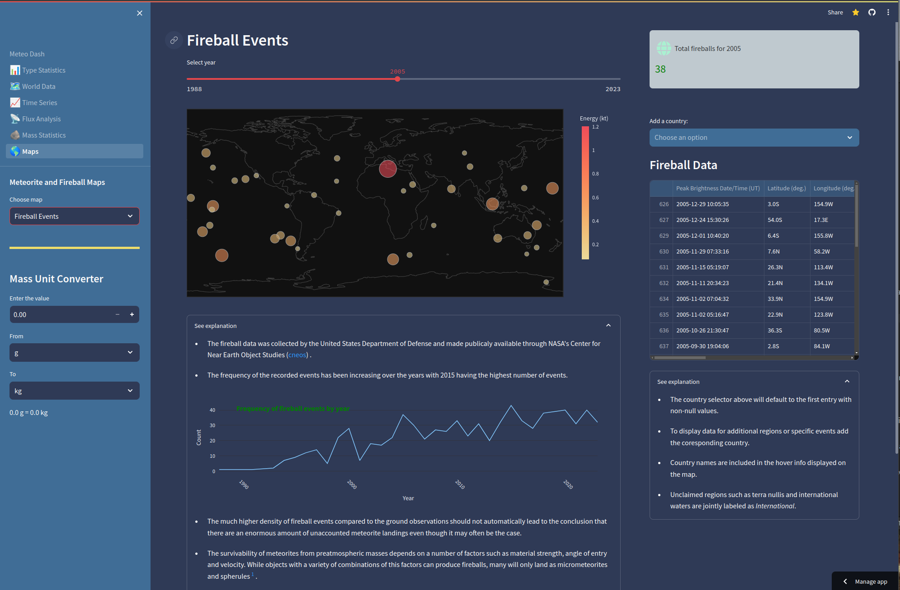

# Meteo Dash

##  A hands-on meteorite landing data exploration app 

---

**About the project**

       

Explore meteorite landing data with an interactive app, providing a captivating journey through celestial impacts on Earth.

---

`Link to the interactive dashboard:` <a href="https://meteo-dash.streamlit.app">meteo-dash.streamlit.app</a> 

**Requirements**

<table border="0" cellpadding="0" cellspacing="0">
            <tr height="16" hidden>
                <td colspan="16">
                    JupyterLab
                </td>             
                <td colspan="16">
                    Pandas
                </td>            
                <td colspan="16">
                    Numpy
                </td>            
                <td colspan="16">
                    Streamlit
                </td>
            </tr>
            <tr height="16">    
                <td colspan="16">
                    Matplotlib
                </td>          
                <td colspan="16">
                    Seaborn
                </td>
                <td colspan="16">
                    Plotly                
                </td>              
                <td colspan="16">
                    Scipy
                </td>
            </tr>
            <tr height="16">                
                <td colspan="16">
                    Folium
                </td>
                <td colspan="16">
                    Hydralit_components
                </td>
                <td colspan="16">
                    Pillow
                </td>	                 
                <td colspan="16">
                    Geopy
                </td>
            </tr>
            <tr height="16">    
                <td colspan="16">
                    Pycountry_convert
                </td>
                <td colspan="16">
                    Tqdm
                </td>            
                <td colspan="16">
                    Pprint
                </td>
                <td colspan="16">
                    Statsmodels.api
                </td>
            </tr>            
    </table>      
       
 

> **Note**: The data analysis was first performed on the back-end side using jupyter notebooks with the dashboard being the final front-end presentation. Accordingly, some of the requirements apply only to the back-end project and some to the fron-end. If you are interested only in the dashboard, the project includes a 'requirements.txt' file that streamlit will scan and install in the deployment stage.  

 

**How to use this project**

To get started with the project, first clone the repository onto your local machine.

Next, create a dedicated python environnent using pipenv or conda.

Install streamlit and the listed requirements within the environment.

For more information and alternative options for creating an environment check the streamlit documentation: 

<a href="https://docs.streamlit.io/get-started">Streamlit Docs</a>

To run the dashboard locally, open a terminal and go to the project folder. Activate the newly created environment and run the following command:

 `streamlit run Meteo_Dash.py`
 
 If you just want to explore the notebooks, than you can install the necessary packages in the base environment using pip or conda without the need to create a virtual environment. 

**Proof of Concept.**  Tailorable to various subjects, this platform showcases the potential for transforming complex data into a user-friendly and adaptable format. 

**Contributors**

<a href="https://www.linkedin.com/in/alin-airinei/">Alin Airinei</a>

---

 

# Background
   

Ever wondered what secrets meteorites hold? Meteo Dash lets you explore the fascinating world of meteorite landings through an interactive data visualization portal, bridging the gap between scientific rigor and accessible discovery through a unique hands-on experience.

  
&nbsp; &nbsp; &nbsp; &nbsp;
  

**Key Features:**

**User friendly.** Meteo Dash puts data visualizations front and center, with concise explanations nestled just below, ready to expand at your touch. No distractions, just clear insights at your fingertips. 

**Concise Bullet Point Format.** We understand the importance of clarity. Explanations are presented in a user-friendly bullet point format, ensuring easy readability and facilitating presentations to diverse audiences. 

**Go beyond the bullet points.** Meteo Dash empowers you to delve deeper than pre-digested summaries. Explore data yourself, uncover hidden patterns, and draw your own conclusions. It's like having a scientist's notebook in your pocket, ready to spark your curiosity.

  
&nbsp; &nbsp; &nbsp; &nbsp;
  

**Aggregated Data Sources.** Drawing from reputable sources such as NASA, The Meteoritical Society, The NHM Meteorite Catalogue, and the World Bank, Meteo Dash provides a comprehensive overview by combining data from multiple sources.

**Citation Integration.** Meteo Dash includes in-text references as links, marked by superscript numbers. The rigor of the chosen citation method is not exactly on par with a scientific paper approach but aims to direct the user to further resources where needed, including scientific papers. 

**Dive deeper, if you dare.** For those seeking further insights, Meteo Dash recommends "Systematics and Evaluation of Meteorite Classification" by Weisberg et al. This serves as the basis for the adopted classification method, offering an excellent companion for users with varying levels of tolerance for formal scientific literature.

  
&nbsp; &nbsp; &nbsp; &nbsp;
  

**Meteo Dash** is your gateway to scientific discovery. Dive into meteorite origins, compositions, and impacts, understanding the stories they tell us about the universe.

